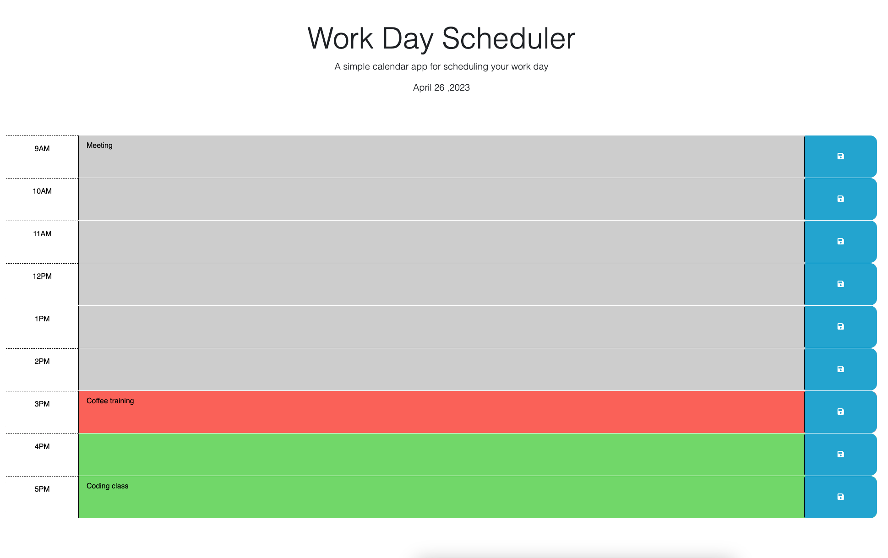

# Work Day Scheduler

# Github page
- https://shok1to.github.io/WorkDay-Scheduler
# Repository
- https://github.com/Shok1to/WorkDay-Scheduler

## Description
- a simple calendar application that allows a user to save events for each hour of the day by modifying starter code. This app will run in the browser and feature dynamically updated HTML and CSS powered by jQuery.

- Display current day at the top of the calendar

- Presented with timeblocks for standard business hours

- Each timeblock is color coded to indicate whether it is in the past, present, or future

- To be able to add an event into a timeblock

- When the save button for that timeblock is clicked,the text for that event is saved in local storage

- When the page was refreshed,the saved events persist

## Contributor
- Georgeyoo

